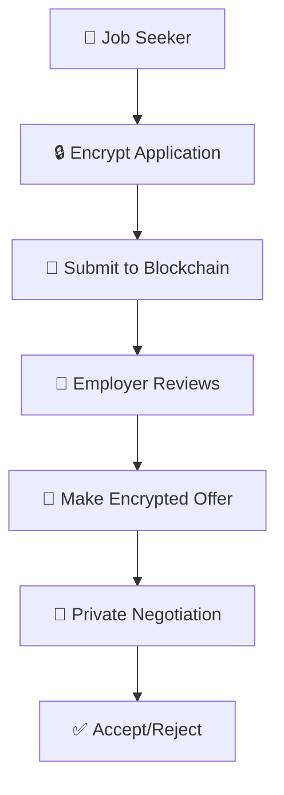

# 🔒 Sealed Offer Drive

> **Revolutionary Privacy-First Job Application Platform**  
> Where your career dreams meet cryptographic security

[](https://opensource.org/licenses/MIT)
[](https://www.typescriptlang.org/)
[](https://reactjs.org/)
[](https://ethereum.org/)

---

## 🌟 What Makes Us Different?

In a world where your personal data is constantly exposed, **Sealed Offer Drive** revolutionizes job applications with **Fully Homomorphic Encryption (FHE)** technology. Your salary expectations, experience details, and personal information remain completely private until you choose to reveal them.

### 🛡️ Privacy by Design
- **Zero-Knowledge Applications**: Submit applications without revealing sensitive data
- **Encrypted Negotiations**: Salary discussions happen in complete privacy
- **Selective Disclosure**: You control what information employers see and when

### ⚡ Cutting-Edge Technology
- **FHE Encryption**: Data stays encrypted even during processing
- **Blockchain Security**: Immutable, transparent, and secure
- **Modern Web3**: Seamless wallet integration with leading providers

---

## 🚀 Quick Start

### Prerequisites
- **Node.js** 18+ 
- **npm** or **yarn**
- **Web3 Wallet** (MetaMask, Rainbow, etc.)

### Installation

```bash
# Clone the repository
git clone https://github.com/antonperez33/sealed-offer-drive.git
cd sealed-offer-drive

# Install dependencies
npm install

# Set up environment
cp env.example .env.local

# Start development server
npm run dev
```

🎉 **That's it!** Open [http://localhost:8080](http://localhost:8080) to see the magic.

---

## 🔧 Configuration

### Environment Variables

Create a `.env.local` file with the following variables:

```env
# Blockchain Configuration
NEXT_PUBLIC_CHAIN_ID=11155111
NEXT_PUBLIC_RPC_URL=https://sepolia.infura.io/v3/YOUR_INFURA_KEY
NEXT_PUBLIC_WALLET_CONNECT_PROJECT_ID=YOUR_WALLET_CONNECT_ID

# Smart Contract (Update after deployment)
NEXT_PUBLIC_CONTRACT_ADDRESS=0x...
```

> ⚠️ **Security Note**: Never commit sensitive keys to version control. Use environment variables for all secrets.

---

## 🏗️ Architecture

### Frontend Stack
- **⚛️ React 18** - Modern UI framework
- **📘 TypeScript** - Type-safe development
- **⚡ Vite** - Lightning-fast build tool
- **🎨 Tailwind CSS** - Utility-first styling
- **🧩 shadcn/ui** - Beautiful component library

### Blockchain Integration
- **🔗 Wagmi** - React hooks for Ethereum
- **🌈 RainbowKit** - Wallet connection made easy
- **⚡ Viem** - TypeScript interface for Ethereum
- **🔒 FHE** - Fully Homomorphic Encryption

### Smart Contract
- **📜 Solidity** - Smart contract language
- **🔐 Zama FHE** - Privacy-preserving computations
- **🌐 Sepolia** - Ethereum testnet deployment

---

## 🔐 How It Works



### 1. **Encrypted Application**
Your resume, salary expectations, and personal details are encrypted using FHE technology before submission.

### 2. **Selective Visibility**
Employers see only your skills summary and cover letter initially. Full details are revealed only after mutual interest.

### 3. **Private Negotiations**
Salary discussions happen in complete privacy. Neither party sees the other's data until agreement is reached.

### 4. **Blockchain Security**
All interactions are recorded on the blockchain, ensuring transparency and preventing tampering.

---

## 🛠️ Development

### Available Scripts

```bash
npm run dev          # Start development server
npm run build        # Build for production
npm run preview      # Preview production build
npm run lint         # Run ESLint
npm run deploy:vercel # Deploy to Vercel
```

### Project Structure

```
src/
├── components/          # React components
│   ├── ui/             # Reusable UI components
│   ├── WalletConnect.tsx
│   └── ApplicationForm.tsx
├── hooks/              # Custom React hooks
│   └── useContract.ts  # Smart contract integration
├── lib/                # Utility functions
│   └── wallet.ts       # Wallet configuration
└── pages/              # Page components
```

---

## 🚀 Deployment

### Vercel (Recommended)

1. **Connect Repository**
   - Import project from GitHub
   - Select Vite framework preset

2. **Configure Environment**
   - Add environment variables
   - Set build command: `npm run build`
   - Set output directory: `dist`

3. **Deploy**
   - Click deploy and wait for completion
   - Your app will be live at `your-project.vercel.app`

### Smart Contract Deployment

See [SMART_CONTRACT_DEPLOYMENT.md](./SMART_CONTRACT_DEPLOYMENT.md) for detailed instructions.

---

## 🤝 Contributing

We welcome contributions! Here's how you can help:

1. **🐛 Report Bugs** - Open an issue with detailed information
2. **💡 Suggest Features** - Share your ideas for improvement
3. **🔧 Submit PRs** - Fix bugs or add new features
4. **📚 Improve Docs** - Help others understand the project

### Development Workflow

```bash
# Fork the repository
git clone https://github.com/YOUR_USERNAME/sealed-offer-drive.git

# Create feature branch
git checkout -b feature/amazing-feature

# Make changes and commit
git commit -m "Add amazing feature"

# Push and create PR
git push origin feature/amazing-feature
```

---

## 📄 License

This project is licensed under the **MIT License** - see the [LICENSE](LICENSE) file for details.

---

## 🙏 Acknowledgments

- **Zama** for FHE technology
- **Rainbow** for wallet integration
- **Vercel** for deployment platform
- **shadcn** for beautiful components

---

## 📞 Support

- **🐛 Bug Reports**: [GitHub Issues](https://github.com/antonperez33/sealed-offer-drive/issues)
- **💬 Discussions**: [GitHub Discussions](https://github.com/antonperez33/sealed-offer-drive/discussions)
- **📧 Contact**: Open an issue for direct communication

---

<div align="center">

**Built with ❤️ for privacy-conscious job seekers**

[⭐ Star this repo](https://github.com/antonperez33/sealed-offer-drive) | [🐛 Report Bug](https://github.com/antonperez33/sealed-offer-drive/issues) | [💡 Request Feature](https://github.com/antonperez33/sealed-offer-drive/issues)

</div>